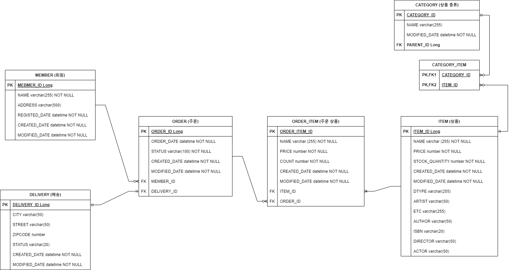

# 요구사항

- 회원은 상품을 주문할 수 있음
- 주문 시 여러 종류의 상품을 선택할 수 있음

## 항목 별 기능

### 회원 기능

- 회원 등록
- 회원 삭제

### 상품 기능

- 상품 등록
- 상품 조회
- 상품 삭제

### 주문 기능

- 상품 주문
- 주문 내역 조회
- 주문 취소

# 도메인 설계

요구사항에 따른 ERD

### MEMBER

- NAME : 회원명
- ADDRESS : 회원 주소
- REGISTED_DATE : 가입 일시

### ORDER

- ORDER_DATE : 주문 일시
- STATUS : 주문상태 (대기, 완료, 취소)
- MEMBER_ID : MEMBER 테이블에 대한 외래키

### ORDER_ITEM

- NAME : 주문 상품명
- PRICE : 주문 상품 가격
- COUNT : 주문한 상품 개수
- ITEM_ID : ITEM 테이블에 대한 외래키
- ORDER_ID : ORDER 테이블에 대한 외래키

### ITEM

- NAME : 상품명
- PRICE : 상품 가격
- STOKC_QUANTITY : 재고량